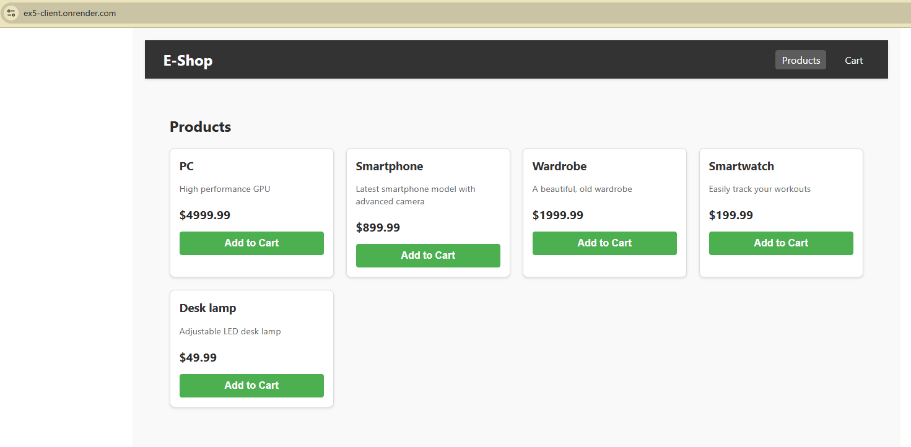
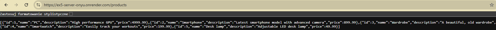

**Zadanie 10**

Chmura/CI. Należy wykorzystać GitHub Actions (dopuszczalne są inne rozwiązania
CI) oraz chmurę Azure (dopuszczalne inne chmury), aby zbudować oraz
zdeployować aplikację kliencką (frontend) oraz serwerową (backend)
jako osobne dwie aplikacje. Należy do tego wykorzystać obrazy
dockerowe, a aplikacje powinny działać na kontenerach. Dopuszczalne
jest zbudowanie wcześniej aplikacji (jar package) oraz budowanie
aplikacji via Github Actions. Należy zwrócić uwagę na zasoby dostępne
na chmurze.

- :white_check_mark: 3.0 Należy stworzyć odpowiednie instancje po stronie chmury na
dockerze - [Link do commita 1](https://github.com/Blato122/E-Biznes-2024.25/commit/a5a3d94c7a07ba4436c544740acb6a528367209b)
- :white_check_mark: 3.5 Stworzyć odpowiedni pipeline w Github Actions do budowania
aplikacji (np. via fatjar) - [Link do commita 2](https://github.com/Blato122/E-Biznes-2024.25/commit/91a9b3e10bba1c2e27ea80dd72829464c419bd57)
- :x: 4.0 Dodać notyfikację mailową o zbudowaniu aplikacji - [Link do commita 3](https://github.com/Blato122/E-Biznes-2024.25/commit/)
- :x: 4.5 Dodać krok z deploymentem aplikacji serwerowej oraz klienckiej na
chmurę - [Link do commita 4](https://github.com/Blato122/E-Biznes-2024.25/commit/)
- :x: 5.0 Dodać uruchomienie regresyjnych testów automatycznych
(funkcjonalnych) jako krok w Actions - [Link do commita 5](https://github.com/Blato122/E-Biznes-2024.25/commit/)

In 'E-biznes-2024.25/ex5' directory:
- docker build -t blato122/ex5-client:latest -f client.Dockerfile . --build-arg REACT_APP_API_URL="https://ex5-server-onyu.onrender.com"
- docker build -t blato122/ex5-server:latest -f server.Dockerfile .
- docker login
- docker push blato122/ex5-client:latest
- docker push blato122/ex5-server:latest

Render:
- create a free account
- new web service
- from existing image

Client: https://ex5-client.onrender.com
Server: https://ex5-server-onyu.onrender.com

